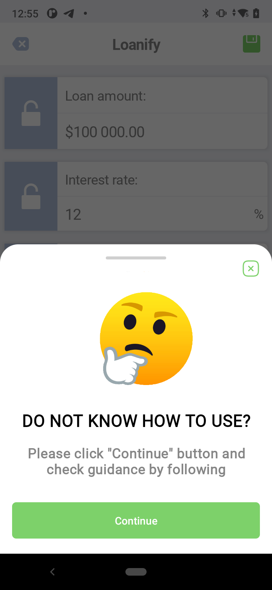
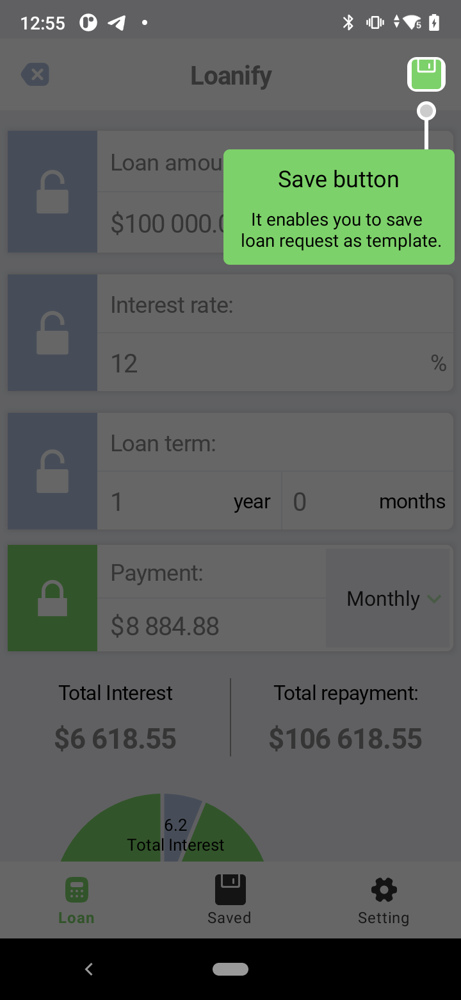
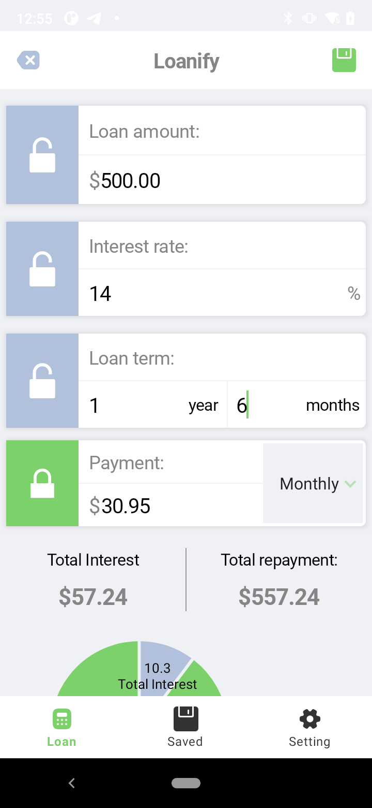
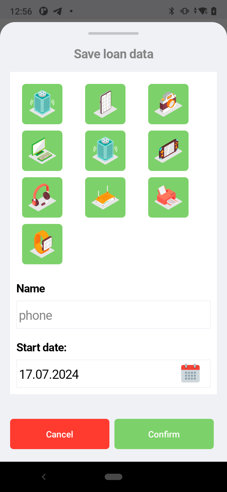
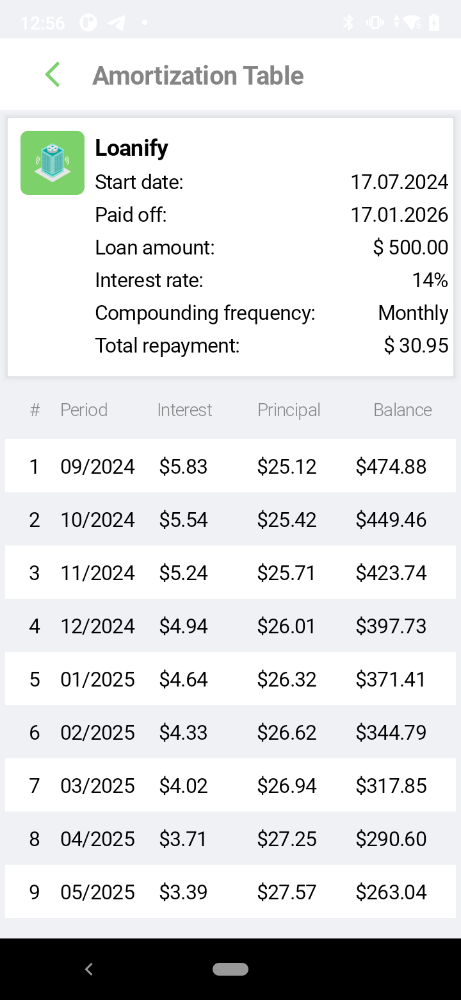
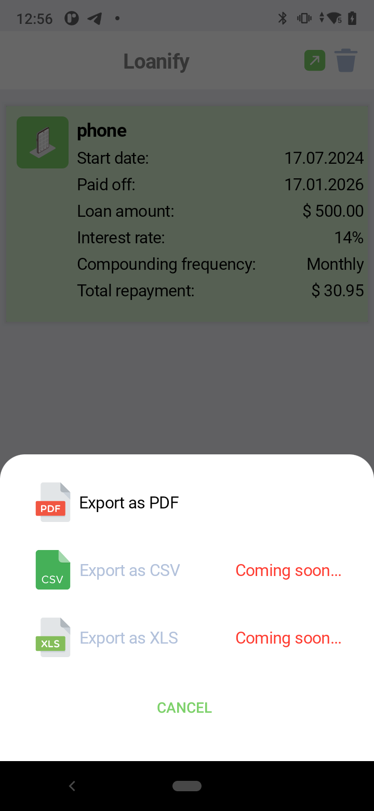
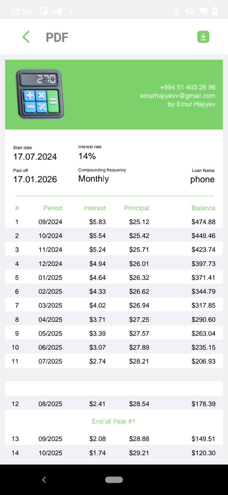
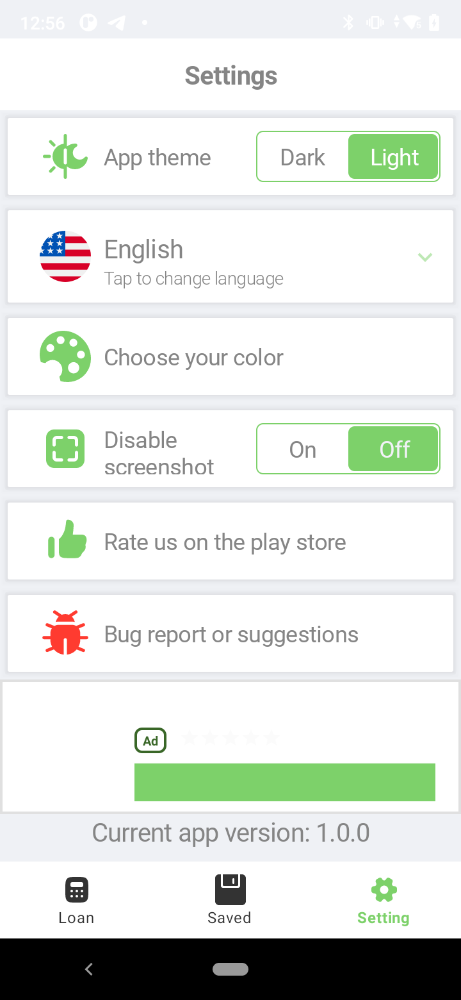
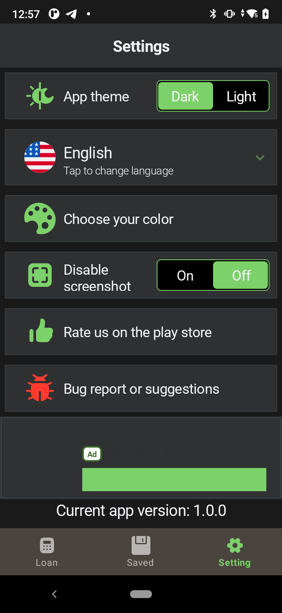
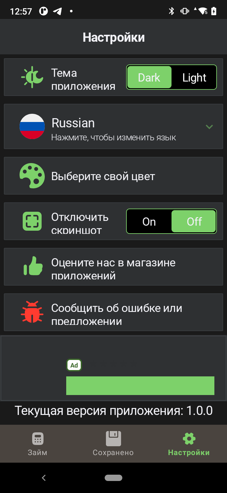

# About
This project developed with a help of multimodule structure and android properties.

     
    
    
    
     
     
    
    
    
    

## Supported with ❤️ by [Elnur]([https://instabug.com/android/sdk?utm_source=toolsofthetrade&utm_medium=spon&utm_content=header](https://www.linkedin.com/in/hajiyevelnur/))

# How to Use Demo
Clone or download whole package then check each part of module.

# Content
- [Architecture](#architecture)
- [Modules](#modules)
    - [Domain](#domain)
    - [Common](#common)
    - [BuildSrc](#buildsrc)
    - [Core](#core)
    - [Data](#data)
    - [Features](#features)
    - [UiKit](#uikit)
- [Design Pattern](#pattern)
- [Coroutines](#coroutines)
- [Dependency Injection](#dinjection)
- [Room DB](#room)
- [Firebase](#firebase)

- ## Architecture
MVI Architecture applied in this project with a help of STATE (state of views) AND EFFECT(side effects that shown only once).
This is each module dependency

  

This is whole app architecture

  

- ## Domain
Viewmodel won't communicate directly to the repository. There is domain layer in between.  viewmodel 》domain(usecases) 》repository. Domain layer holds usecases that helps viewmodel to call usecases. 

- ## Common
This module holds extensions,common utils,common methods and functions. the module which includes common that is able to use all common files.

- ## BuildSrc
This module holds libraries version codes, version numbers, package names etc.

- ## Core
This module holds base classes,common loading,navigation commands, delegates function.

- ## Data
This contains the application data and business logic. Data source classes bridge between your app and the system for data operations. Other layers are never supposed to directly access the data layer and the only entry points to the data layer should be through repository classes

- ## Features
This module contains feature packages of current app such as loan,save and setting

- ## UiKit
This module contains all custom ui classes such as labels, button, toolbar, fonts, colors, cutom animations etc.

- ## Design Pattern
There is singleton, repository, observable and builder pattern used.

- ## Coroutines
Coroutines used to write asynchronous code in a synchronous way such as network call. launch method used to create a coroutine that does not return a result. Please check code. Each CoroutineScope types has been applied in project.

- ## Dependency Injection
Dagger2 has been used delegate the creation of objects. Some class instance such as database(dao), context, repository, retrofir, convertor, api and etc. has been created by using dagger2. 

- ## Room DB
It is used Room to save data in a local database.

- ## Firebase
Firebase analytics and notification services added.
