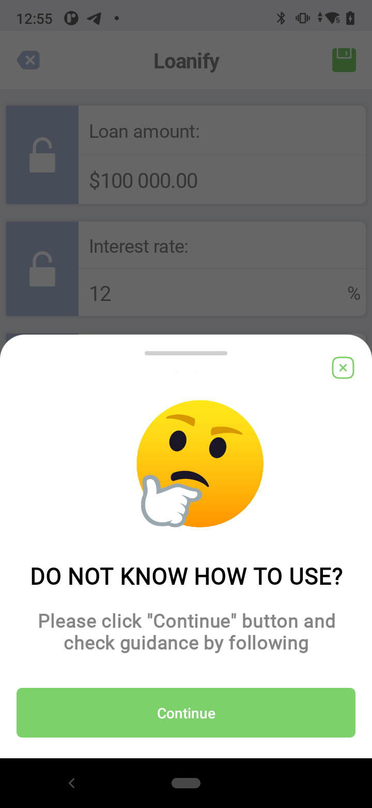
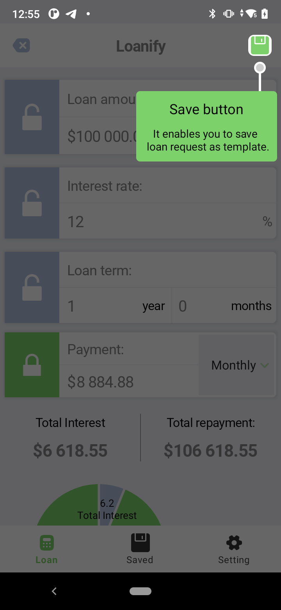
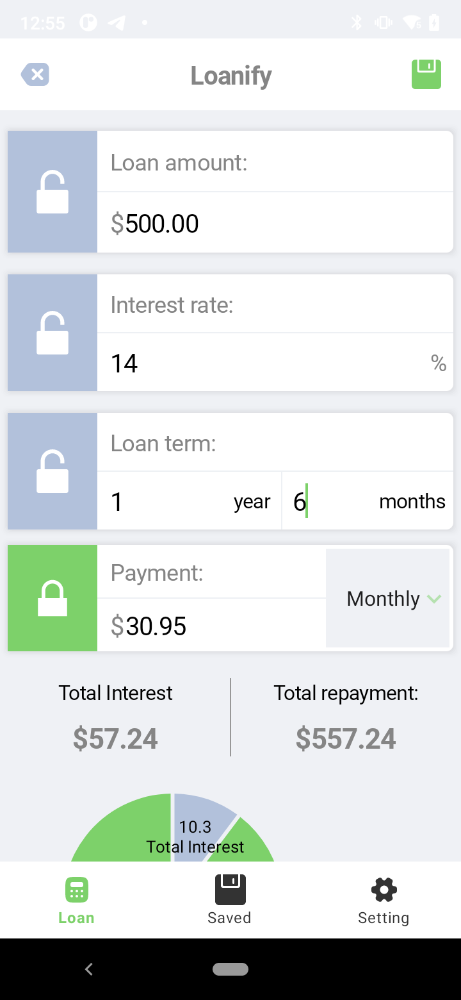
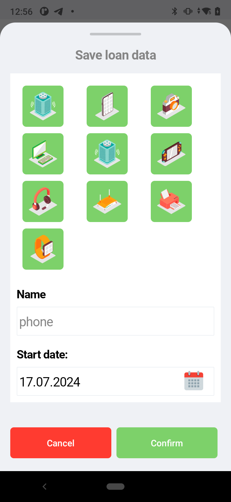
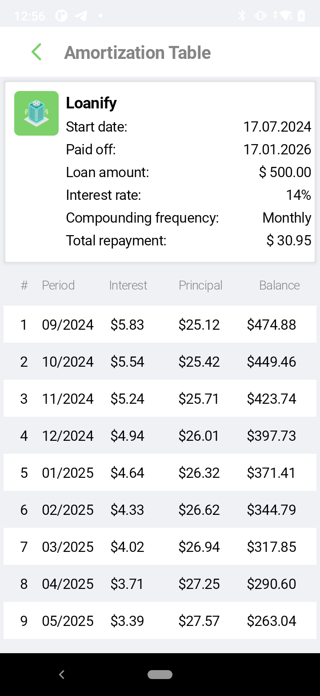
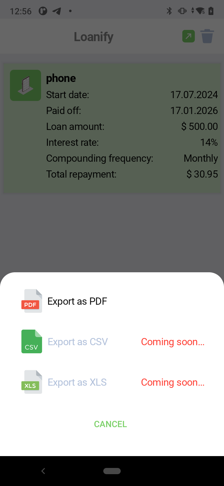
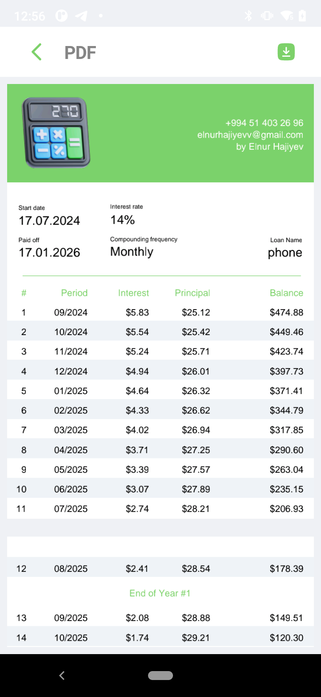
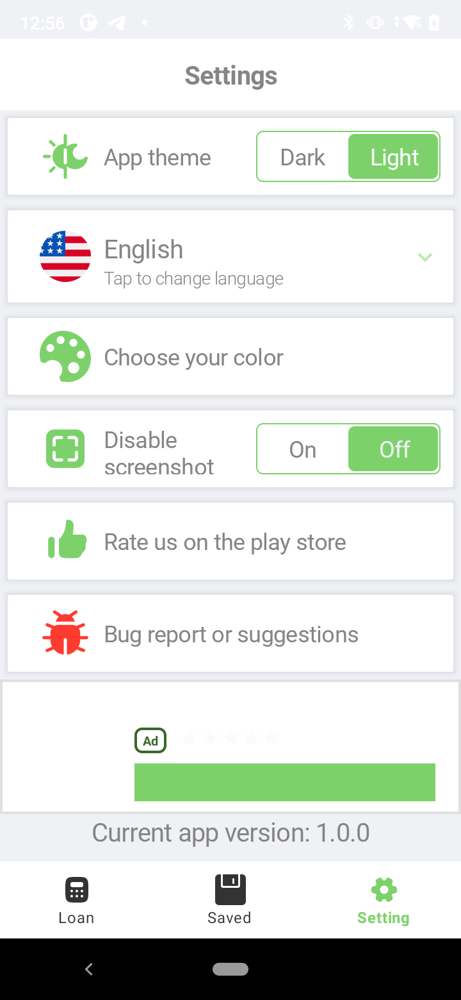
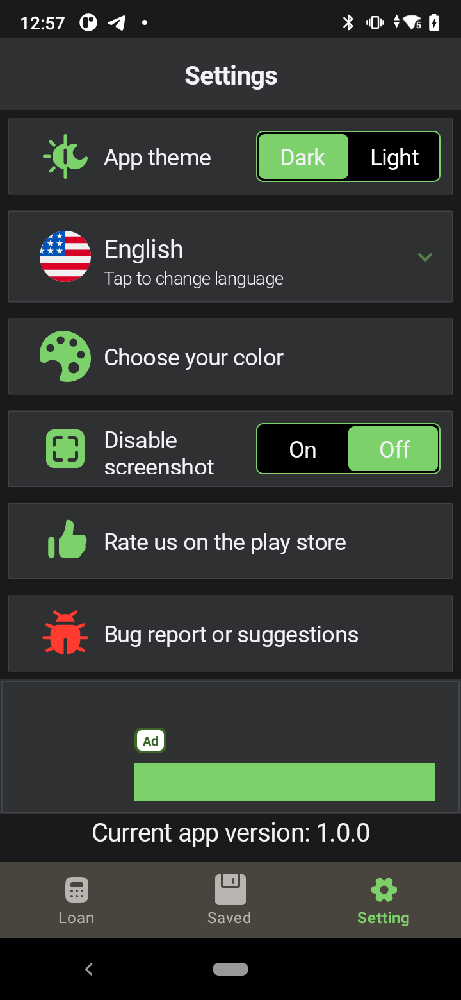
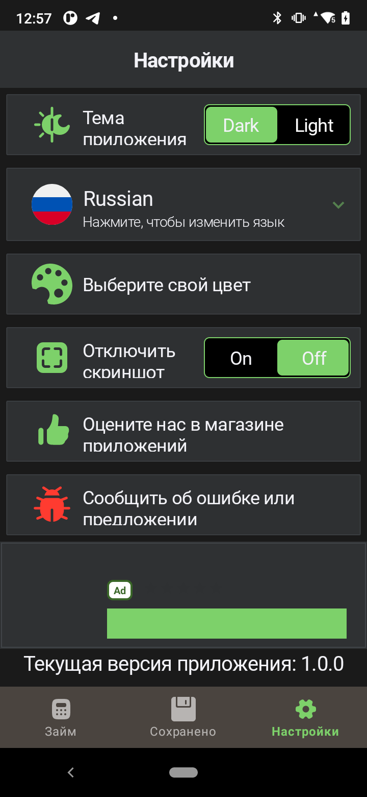

## Loanify – Advanced Loan Calculator (Multi‑Module Android App)

**Loanify** is a production‑style, multi‑module Android application that demonstrates an advanced loan calculator with amortization schedule, saving planner, and settings, built on a clean MVI architecture with a strong focus on scalability, testability, and reusability.

<p float="left">
  
  
  
  
  
  
  
  
  
  
</p>

---

### Table of Contents

- **Overview**
- **Feature Set**
- **Architecture**
- **Module Structure**
- **Tech Stack**
- **Getting Started**
- **Build, Run & Flavors**
- **Code Style & Static Analysis**
- **Dependency Injection**
- **Data Layer & Persistence**
- **Coroutines & Concurrency**
- **Analytics, Crash Reporting & Notifications**
- **UI Kit & Design System**
- **Extending the Project**
- **Author**

---

### Overview

**Loanify** is designed as a reference application for:

- **Multi‑module Android architecture** that separates concerns clearly.
- **Clean MVI** with `State` and one‑off `Effect`s to drive the UI.
- **Fully reusable UI components** via the `uiKit` module.
- **Scalable feature development** through feature‑scoped modules (`loan`, `save`, `setting`).

The project is suitable as:

- A **learning resource** for advanced Android patterns.
- A **starter template** for financial/loan‑related apps.
- A **showcase** of module boundaries, DI setup, and navigation in a real app.

---

### Feature Set

- **Loan calculation**
  - Monthly payment and total payable amount.
  - **Amortization schedule** with principal/interest split per period.
  - Support for different term lengths and interest rates.

- **Saving / investment planner**
  - Plan savings over time with contributions and interest assumptions.
  - Visual breakdown per period/year.

- **Settings**
  - Change language (supports multiple locales, e.g., `en`, `tr`, `ru`, `es`).  
  - Manage preferences related to notifications, currency formatting, etc.

- **Saved scenarios**
  - Persisted loan/saving configurations using **Room** for quick comparison.

- **Analytics & engagement**
  - **Firebase Analytics** and **Crashlytics** integration.
  - **OneSignal** & Play Services for push / engagement use‑cases.

---

### Architecture

- **Pattern**: **MVI (Model–View–Intent)** with:
  - **State**: Full UI state of the screen (rendered every time).
  - **Effect**: One‑shot events (navigation, toasts, dialogs, etc.).

- **Layering** (high‑level flow):
  - UI (Activities/Fragments/ViewBinding)  
    → **ViewModel (MVI)**  
    → **Domain (UseCases)**  
    → **Repositories (Data layer)**  
    → **Local/Remote data sources (Room, network, etc.)**

- **Module dependencies diagram**

The app follows a **strict dependency direction** from outer layers to inner/core modules. The approximate dependency graph is:

- `app` → `core`, `domain`, `data`, `common`, `features:*`, `uiKit`, `showCase`
- `features:*` → `domain`, `data`, `core`, `common`, `uiKit`
- `data` → `domain`, `common`
- `domain` → `common`

Architecture diagrams are available in the README images and in the linked diagrams:

<p align="center">
  
</p>

<p align="center">
  
</p>

---

### Module Structure

Root multi‑module definition (`settings.gradle.kts`):

- **`app`** – Android application module
- **`core`** – Base classes, common loading, navigation commands, delegates
- **`domain`** – Use cases, business rules and interfaces
- **`data`** – Repositories, DAOs, data sources (local/remote)
- **`features:loan`** – Loan calculator feature (screens, ViewModels, intents, state)
- **`features:save`** – Saving planner feature
- **`features:setting`** – Settings and configuration feature
- **`common`** – Extensions, utilities, and general helpers
- **`uiKit`** – Reusable UI components (buttons, labels, toolbars, animations, etc.)
- **`showCase`** – Module used to demo and showcase UI components and flows

#### Domain

- **Responsibility**: Encapsulate business use‑cases, independent of frameworks.
- Typical flow: `ViewModel → UseCase → Repository`.  
  ViewModels never talk directly to data sources.

#### Data

- **Responsibility**: Application data and business logic implementation.
- Exposes **repositories** as the single entry point to data operations.
- Bridges UI/domain to underlying persistence and networking.

#### Core

- **Responsibility**: Cross‑cutting infrastructure for the app:
  - Base `ViewModel`s and MVI scaffolding.
  - Navigation commands and helpers.
  - Common loading / error handling abstractions.
  - Delegates for repetitive behaviors.

#### Common

- **Responsibility**: Pure utilities & shared helpers:
  - Extension functions.
  - Common methods/constants.
  - Small, framework‑independent utilities.

#### Features (`loan`, `save`, `setting`)

- **Responsibility**: End‑user features with their own screens, states, and navigation.
- Each feature uses:
  - `domain` use‑cases.
  - `data` repositories.
  - `core` base abstractions.
  - `common` utilities.
  - `uiKit` components.

#### UiKit

- **Responsibility**: Design system and reusable UI kit.
- Contains:
  - Buttons, toolbars, labels, custom views.
  - Fonts, colors, themes, text styles.
  - Layouts for lists, amortization tables, saved items, search, etc.
  - Custom animations and motion scenes.

#### BuildSrc

- **Responsibility**: Centralized Gradle configuration:
  - Dependency versions (`ApplicationVersions`).
  - Common plugin versions and module IDs.
  - Application configuration (`ApplicationConfig`, `ApplicationModules`, `ApplicationDependencies`).

#### ShowCase

- **Responsibility**: Isolated space to **demonstrate components and flows**.  
  Useful for design review and experimenting with new UI/UX without touching production flows.

---

### Tech Stack

- **Language**: Kotlin
- **Gradle**: Kotlin DSL (`build.gradle.kts`)
- **Architecture**: MVI, Clean Architecture layering
- **DI**: Dagger Hilt
- **Async**: Kotlin Coroutines, structured concurrency
- **Persistence**: Room
- **Navigation**: Jetpack Navigation with SafeArgs
- **Static Analysis**: Detekt, custom configuration (`.detekt/detekt-config.yml`)
- **Analytics & Crash Reporting**: Firebase (Analytics, Crashlytics)
- **Push / Engagement**: OneSignal, Google Play Services
- **Ads / Monetization**: Google Mobile Ads SDK
- **Build tools**: Custom Gradle plugins (`graphfity`, Dynatrace plugin)

---

### Getting Started

#### Prerequisites

- **Android Studio** (Giraffe or newer recommended).
- **JDK 8+** installed and configured (project uses `JavaVersion.VERSION_1_8`).
- A valid **Android SDK** and **Google Play services** set up.
- Optional: A Firebase project if you want to wire your own analytics/crash config.

#### Clone the project

```bash
git clone https://github.com/<your-username>/loan_calculator.git
cd loan_calculator
```

#### Open in Android Studio

1. **File → Open**, select the root `loan_calculator` directory.
2. Let Gradle sync and download all dependencies.
3. Select the `app` run configuration.
4. Run on an emulator or physical device.

> **Note**: Signing config for `debug` is pre‑configured in `app/build.gradle.kts` with a local `debug.jks`. You may adjust or replace this for your environment if necessary.

---

### Build, Run & Flavors

- The `app` module has standard **`debug`** and **`release`** build types.
- Release build comes with:
  - ProGuard/R8 rules.
  - Crashlytics and analytics configuration.
- To build from the command line:

```bash
./gradlew assembleDebug
./gradlew assembleRelease
```

> For CI/CD, you can reuse the same Gradle tasks and integrate Detekt (see below) into your pipeline.

---

### Code Style & Static Analysis

- **Detekt** is applied to all modules (`allprojects` block in `build.gradle.kts`):
  - Input: `src/main/java`, `src/main/kotlin`
  - Parallel execution enabled.
  - Custom configuration via `.detekt/detekt-config.yml`.
  - HTML report generated at `build/reports/detekt.html` per module.

- To run Detekt manually:

```bash
./gradlew detekt
```

Following Detekt recommendations keeps code quality high and consistent across modules.

---

### Dependency Injection

- **Dagger Hilt** is used as the main DI framework.
- The app module applies `dagger.hilt.android.plugin` and uses `kapt` for code‑gen.
- Typical patterns:
  - `@HiltAndroidApp` for the application class.
  - `@AndroidEntryPoint` on Activities/Fragments.
  - `@Module` + `@InstallIn` for providing repositories, DAOs, Retrofit APIs, etc.

The goal is that **feature modules** and **domain layer** depend on abstractions and can be tested in isolation, while Hilt wires implementations in the app and data layers.

---

### Data Layer & Persistence

- **Repositories** are the only entry point into the `data` layer.
- Under the hood, a repository may talk to:
  - **Room DAOs** for local persistence (e.g., saved loans, savings plans).
  - Potential remote data sources (e.g., exchange rates or configuration).

- **Room** is used to:
  - Store amortization entries, saved scenarios, user settings, etc.
  - Provide offline‑first behavior where appropriate.

The domain layer does not know about Room or any specific persistence framework; it only uses repository interfaces.

---

### Coroutines & Concurrency

- Kotlin Coroutines are used throughout for asynchronous work such as:
  - Long‑running calculations (amortization).
  - Database calls.
  - Network / I/O (if present).

- Key ideas applied:
  - **Structured concurrency** via `viewModelScope` and feature‑specific scopes.
  - `launch` for fire‑and‑forget UI operations, `async/await` for parallel work where needed.
  - Proper dispatchers for I/O vs. Main operations.

This keeps the UI responsive while computations and data operations happen off the main thread.

---

### Analytics, Crash Reporting & Notifications

- **Firebase BOM** is configured in `app/build.gradle.kts`:
  - Analytics.
  - Crashlytics.
  - Authentication support (if enabled).

- **OneSignal** is added to enable advanced push notifications and engagement features.

You can plug in your own keys and configuration for production usage (bundle IDs, sender IDs, etc.).

---

### UI Kit & Design System

The `uiKit` module acts as a **central design system** for the entire app:

- **Themes & styles**: Colors, typography, dimensions, text styles.
- **Components**: Buttons, labels, toolbars, editable seekbars, list items for amortization, saved entries, etc.
- **Layouts**: Modular XML layouts reused across features.
- **Animations**: Motion scenes (e.g., `amortization_motion_scene.xml`) and custom transitions.

This makes it easy to maintain a consistent look & feel and to reuse widgets in new features or apps.

---

### Extending the Project

Some ideas for extending **Loanify**:

- **New loan types**: Add support for interest‑only, balloon payments, or variable interest rates.
- **Charts & visualization**: Integrate MPAndroidChart (or similar) to show payment breakdowns.
- **Cloud sync**: Sync saved scenarios across devices via Firebase or your own backend.
- **Export & share**: Export amortization schedules to CSV/XLS or PDF.
- **More locales & currencies**: Extend `values-*` resources for more regions and formats.

To add a new feature:

1. Create a new module under `features:newFeature`.
2. Wire it to `domain`, `data`, `core`, `common`, and `uiKit` as needed.
3. Register its navigation entry points in the app module.

---

### Author

**Supported with ❤️ by [Elnur Hajiyev](https://www.linkedin.com/in/hajiyevelnur/)**  
If you find this project useful, feel free to connect, open issues, or contribute improvements.
